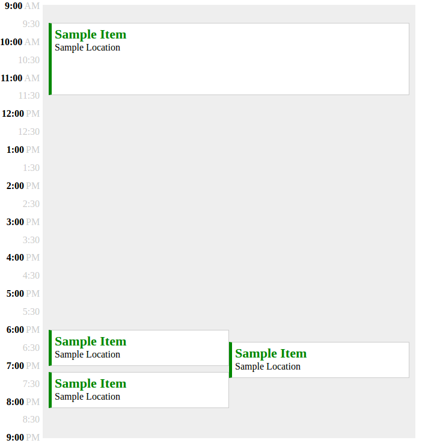

# SingleDayCalendar

SingleDayCalendar is a calendar app developed in JavaScript and renders a set of events on a single
day. The layout has several properties:

- Events do not overlap.
- Colliding events have the same width.
- Width of events must be the maximum value possible.
- Each event object must have start and end attributes which are the
number of minutes since 9:00 am. End value must be larger than start value.
- Each event object may have item and location attributes.

## Usage

Clone the repository and cd into the corresponding folder

```
$ git clone https://github.com/HCoban/SingleDayCalendar
$ cd SingleDayCalendar
```

open `index.html` in your browser.

You can invoke layOutDay function in your browser's developer console to
render custom events using the following format

```javascript
var events = [ {start: 0, end: 20}, {start: 100, end: 120} ];
layOutDay(events);
```

## Implementation and Development

Each event's widths and X coordinates (CSS left property) are calculated
taken into account their direct and indirect collisions. Direct collisions
are called `adjacent` events and their ids are stored in `CalendarEvent`
object's adjacent attribute. Events which collide either directly or indirectly
share a common event group. Indirect collision between two events means
that they do not collide, however they have a common collision.

For example, in the below calendar there are two event groups. One of them
consists of a single event which takes place from 9:30 am to 11:30 am. The second event group consists of three different events which takes place between 6:00 pm and 8:10 pm.  



The events and event groups are stored as attributes in the `Calendar` object. In addition, a minute object is generated which has minutes as keys and events happening in that minute as values.

For each minute, the maximum number of colliding events are calculated and stored in each event as `widthFactor`. The maximum `widthFactor` of a group's events is considered to be the group's `groupWidthFactor`. Division of container width by an event's corresponding groupWidthFactor gives it's width.

The xCoordinate (horizontal position) of an event is set by `checkSpacesAndSetXCoordinate` function. The function iterates over the adjacent events of an event and checks if a space is already filled. If not, the X coordinate is assigned to the event.

```javascript
function checkSpacesAndSetXCoordinate (currentEvent, groupWidthFactor, calendar) {
  var spaces = new Array(groupWidthFactor);
  currentEvent.adjacent.forEach(function (adjacentId) {
    var adjacent = calendar.getEvent(adjacentId);
    if (adjacent.xCoordinate !== undefined) {
      spaces[adjacent.xCoordinate] = "filled";
    }
  });

  for (var i = 0; i < spaces.length; i++) {
    if (spaces[i] !== "filled") {
      currentEvent.xCoordinate = i;
      break;
    }
  }
}
```

The `xCoordinate` value is then used to calculate CSS left property.

```javascript
eventDiv.style.setProperty("left", `${currentEvent.xCoordinate * groupWidth}px`);
```
